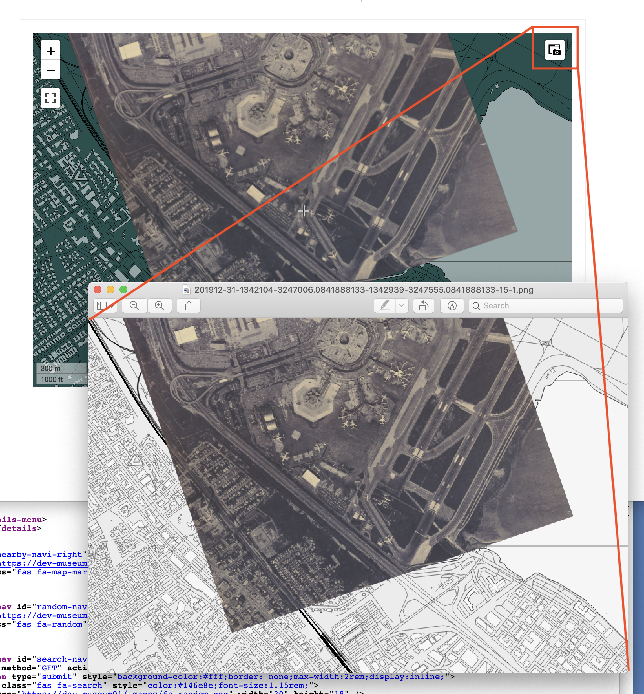

# leaflet-image-control



A Leaflet control element for generating screenshots of a map's viewport, using [leaflet-image](https://github.com/mapbox/leaflet-image) and [FileSaver.js](https://github.com/eligrey/FileSaver.js/).

## Example

First, load the Javascript and CSS libraries for [Leaflet](https://leafletjs.com/download.html) itself. These files are not included with this package.

```
<script type="text/javascript" src="leaflet.js"></script>
<link rel="stylesheet" type="text/css" href="leaflet.css" />
```

Next, load the Javascript the [leaflet-image](https://github.com/mapbox/leaflet-image) and [FileSaver](https://github.com/eligrey/FileSaver.js/) libraries. Copies of these files are included in the [src](src) directory. In the future they may be bundled with `leaflet.image.control.js` itself.

```
<script type="text/javascript" src="leaflet-image.js"></script>
<script type="text/javascript" src="FileSaver.js"></script>
```

Finally load the Javascript and CSS libraries for `leaflet.image.control` itself. Copies of these files are included in the [src](src) directory.

```
<script type="text/javascript" src="leaflet.image.control.js"></script>
<link rel="stylesheet" type="text/css" href="leaflet.image.control.css" />
```

Then in your code you would do something like this:

```
var map = L.map("mapid");

var image_opts = {
	    
    on_success: function(map, control, canvas) {
		
	var dt = new Date();
	var iso = dt.toISOString();
	var iso = iso.split('T');
	var ymd = iso[0];
	ymd = ymd.replace(/-/g, "");
		
	var pt = map.getCenter();
	var zm = map.getZoom();		
		
	var parts = [
	    ymd,
	    pt[0],
	    pt[1],
	    zm
	]
	
	var str_parts = parts.join("_");

	var name = str_parts + ".png";

	control.startSpinning();

	canvas.toBlob(function(blob) {
	    control.stopSpinning();
	    saveAs(blob, name);
	});
    }
    
};
	
var image_control = new L.Control.Image(image_opts);
map.addControl(image_control);
```

## Options

### on_error

A function to be invoked if there was a problem rendering the map's viewport. The function will be passed the reported error.

### on_success

A function to be invoked when the map's viewport has been successfully rendered. The function will be passed the `L.map` object used for the rendering and a the HTML `canvas` element containing the rendered pixels.

### position

A valid [Leaflet Control](https://leafletjs.com/reference-1.6.0.html#control) position indicating where on the map your control should be placed.

## See also

* https://leafletjs.com/
* https://leafletjs.com/examples/layers-control/
* https://github.com/mapbox/leaflet-image
* https://github.com/eligrey/FileSaver.js/